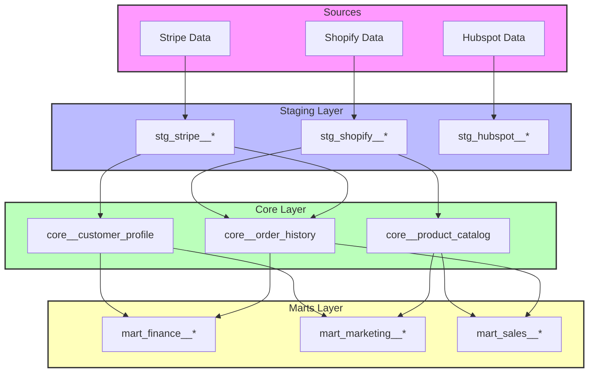
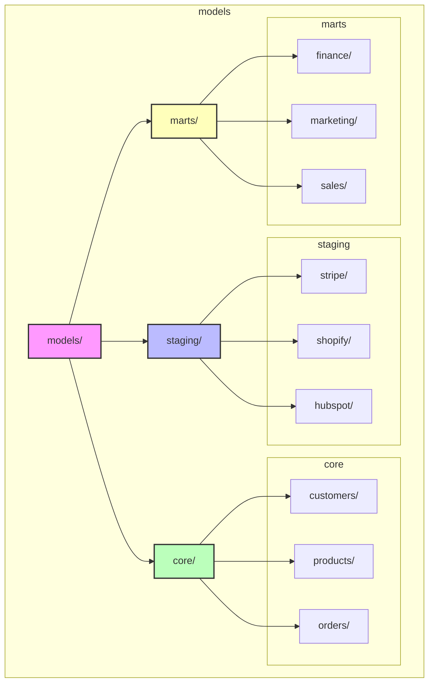
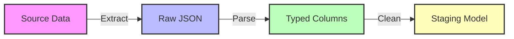
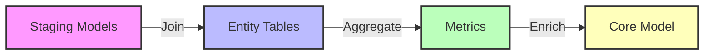
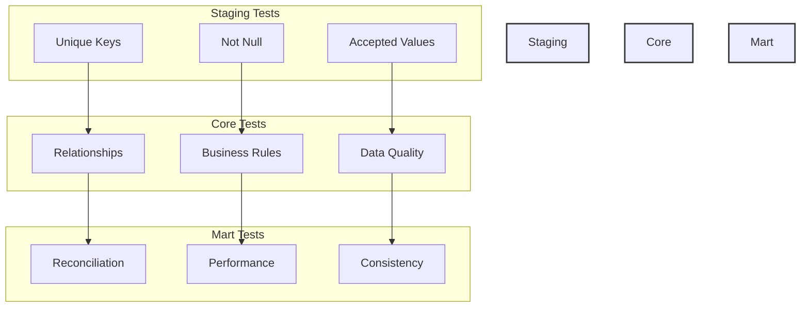
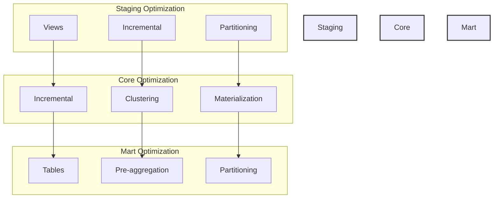

# Data Modeling Guide

This dbt project follows a three-zone data architecture designed for clarity, performance, and maintainability.

## 📊 Project Architecture



## 📁 Project Structure



## 🔄 Data Flow and Zone Concepts

### 1. Staging Models (RAW Zone)


- **Purpose**: Initial data landing and basic cleanup
- **Naming**: `stg_<source>__<entity>`
- **Examples**: 
  - `stg_stripe__customers`
  - `stg_shopify__orders`
- **Properties**:
  - Minimal transformations
  - Source data grain
  - Basic cleaning and typing
  - Views for most tables
  - Incremental for event data

### 2. Core Models (PREPARED Zone)


- **Purpose**: Core business entities and metrics
- **Naming**: `core__<entity>_<description>`
- **Examples**:
  - `core__customer_profile`
  - `core__order_metrics`
- **Properties**:
  - Business entity focused
  - Shared metrics
  - Incremental where possible
  - Well-documented business rules

### 3. Mart Models (CURATED Zone)


- **Purpose**: Business-specific analytics
- **Naming**: `mart_<domain>__<description>`
- **Examples**:
  - `mart_finance__revenue_analysis`
  - `mart_marketing__customer_360`
- **Properties**:
  - Always materialized as tables
  - Optimized for BI tools
  - Domain-specific metrics
  - Often denormalized

## 📝 Model Development Guidelines

### 1. Staging Models
```sql
-- Example: stg_stripe__customers.sql
with source as (
    select * from {{ source('stripe', 'customers') }}
),
renamed as (
    select
        id as customer_id,
        email,
        created as created_at
    from source
)
select * from renamed
```

### 2. Core Models
```sql
-- Example: core__customer_profile.sql
with customer_orders as (
    select
        customer_id,
        count(*) as order_count,
        sum(amount) as total_spent
    from {{ ref('stg_shopify__orders') }}
    group by 1
)
select
    c.customer_id,
    c.email,
    o.order_count,
    o.total_spent
from {{ ref('stg_shopify__customers') }} c
left join customer_orders o using (customer_id)
```

### 3. Mart Models
```sql
-- Example: mart_marketing__customer_360.sql
select
    c.customer_id,
    c.email,
    c.customer_segment,
    o.total_orders,
    o.total_revenue,
    m.campaign_response_rate
from {{ ref('core__customer_profile') }} c
left join {{ ref('core__order_metrics') }} o using (customer_id)
left join {{ ref('core__marketing_metrics') }} m using (customer_id)
```

## 🔍 Testing Strategy



### 1. Staging Tests
```yaml
# staging/stripe/_stripe__models.yml
models:
  - name: stg_stripe__customers
    columns:
      - name: customer_id
        tests:
          - unique
          - not_null
```

### 2. Core Tests
```yaml
# core/customers/_customers__models.yml
models:
  - name: core__customer_profile
    columns:
      - name: customer_id
        tests:
          - unique
          - not_null
          - relationships:
              to: ref('stg_stripe__customers')
              field: customer_id
```

### 3. Mart Tests
```yaml
# marts/marketing/_marketing__models.yml
models:
  - name: mart_marketing__customer_360
    columns:
      - name: customer_id
        tests:
          - unique
          - not_null
      - name: total_revenue
        tests:
          - not_null
          - positive_values
```

## 🚀 Performance Optimization



### 1. Staging Layer
- Use views for reference data
- Incremental models for event data
- Partition by ingestion date

### 2. Core Layer
- Incremental processing where possible
- Partition by business dates
- Cluster by common join keys

### 3. Mart Layer
- Always use table materialization
- Partition by analysis dates
- Cluster by common filters
- Pre-aggregate where possible
