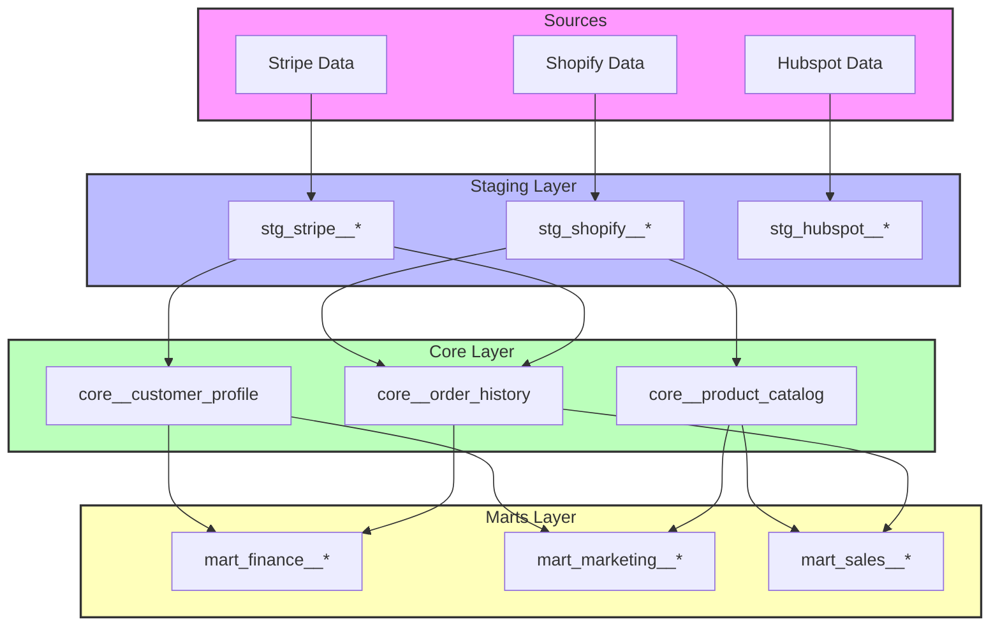
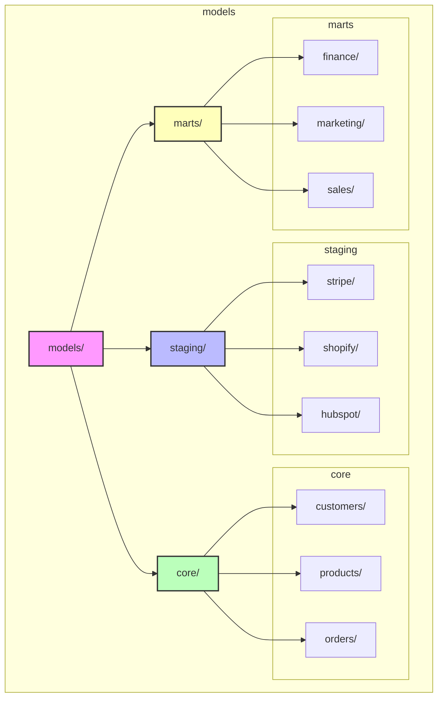
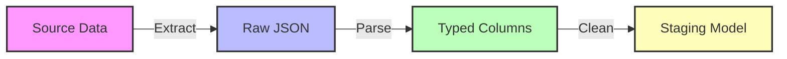
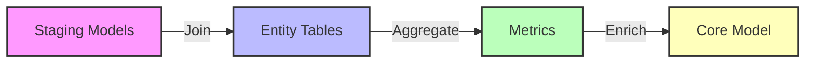

# Data Modeling Guide

This dbt project follows a three-zone data architecture designed for clarity, performance, and maintainability.

## 📊 Project Architecture

## 📁 Project Structure

## 🔄 Data Flow and Zone Concepts

### 1. Staging Models (RAW Zone)

- **Purpose**: Initial data landing and basic cleanup
- **Naming**: `stg_<source>__<entity>`
- **Examples**: 
  - `stg_stripe__customers`
  - `stg_shopify__orders`
- **Properties**:
  - Minimal transformations
  - Source data grain
  - Basic cleaning and typing
  - Views for most tables
  - Incremental for event data

### 2. Core Models (PREPARED Zone)

- **Purpose**: Core business entit