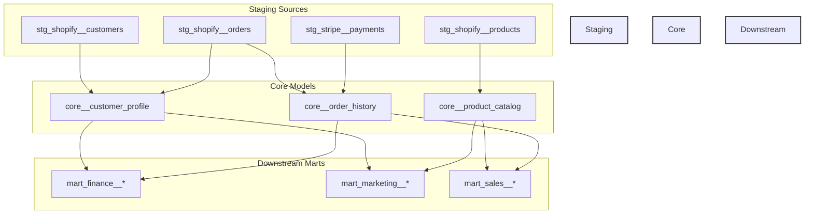
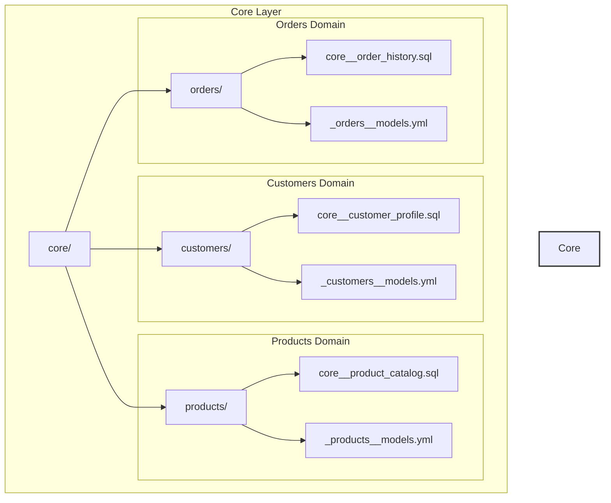
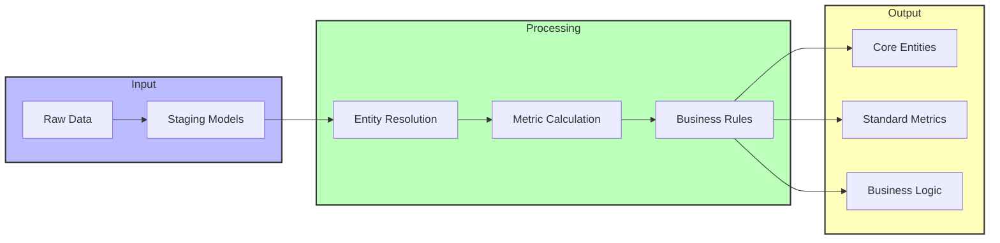
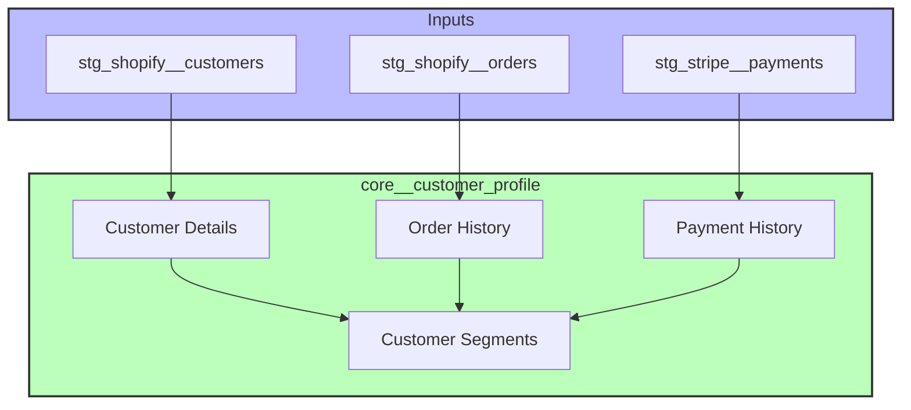
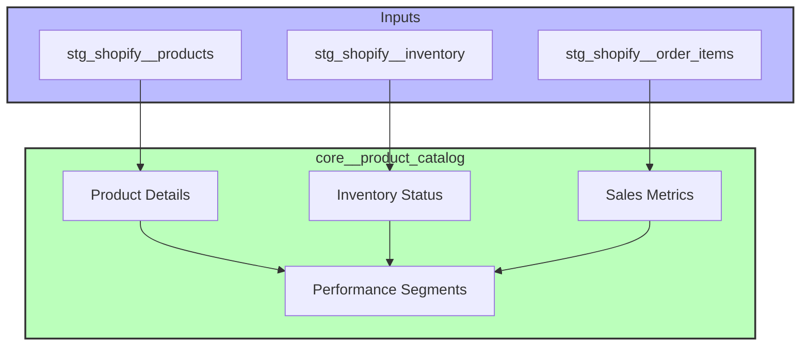
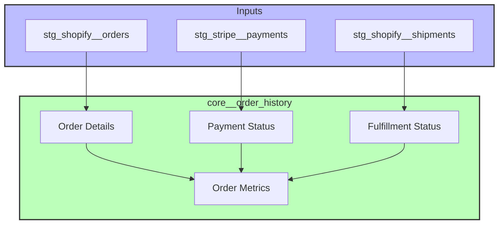
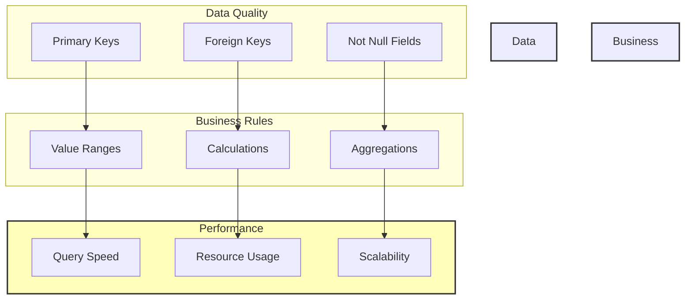
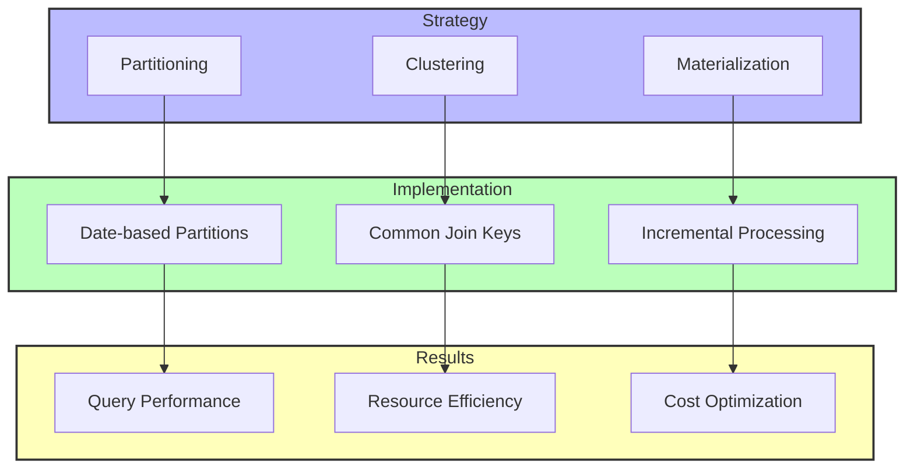
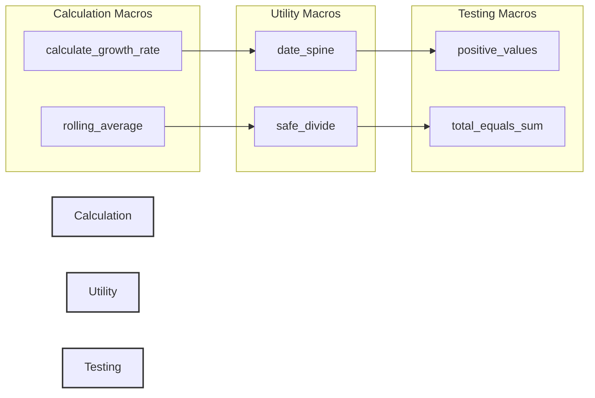

# Core Models

This directory contains core business entities and metrics that are standardized across the organization. These models serve as the foundation for downstream analysis and represent our single source of truth for key business concepts.

## 🏗️ Architecture



## 📁 Structure



## 🔄 Data Flow



## 📊 Key Models

### Customer Models


### Product Models


### Order Models


## 🧪 Testing Strategy



## 🚀 Performance Optimization



## 📝 Development Guidelines

1. **Naming Conventions**
   - Model names: prefix with `core__`
   - Test files: prefix with `test_`
   - Documentation files: suffix with `__models.yml`

2. **Model Configuration**
   - Use incremental models where appropriate
   - Implement proper partitioning and clustering
   - Include comprehensive testing

3. **Documentation**
   - All models must have descriptions
   - Document key columns and business logic
   - Include links to relevant documentation

4. **Testing**
   - Unique and not null tests for primary keys
   - Relationship tests for foreign keys
   - Custom tests for business logic validation

## 🛠️ Common Macros

The following macros are available for use in core models:



## 📈 Example Usage

```sql
-- Calculate customer lifetime value
select
    customer_id,
    sum(total_amount) as lifetime_value,
    {{ calculate_growth_rate('current_month_revenue', 'previous_month_revenue') }} as revenue_growth
from {{ ref('core__order_history') }}
group by 1
```
